# Amit_Max

<div align="center">


<div align="center">
  
</div>

## ⚡ About Me


```typescript
const AmitMax = {
    code: ["JavaScript", "TypeScript", "Python", "Java", "Go"],
    technologies: {
        frontEnd: {
            js: ["React", "Next.js", "Vue", "Angular"],
            css: ["Tailwind", "Sass", "Styled Components"]
        },
        backEnd: {
            js: ["Node", "Express", "Nest.js"],
            python: ["Django", "FastAPI", "Flask"],
            databases: ["MongoDB", "PostgreSQL", "Redis"]
        },
        devOps: ["Docker", "Kubernetes", "AWS", "CI/CD"],
        tools: ["Git", "Webpack", "Vite", "Jest"]
    },
    currentFocus: "Building scalable applications with modern architecture",
    funFact: "I debug with console.log and I'm not ashamed! 🐛"
};
```

<br clear="right"/>

## 🚀 Tech Stack

<div align="center">

### Languages


### Frontend


### Backend


### Databases


### Cloud & DevOps


</div>

## 📊 GitHub Analytics

<div align="center">
  
  
</div>

<div align="center">
  
</div>

## 🏆 GitHub Trophies

<div align="center">
  
</div>

## 📈 Activity Graph

<div align="center">
  
</div>

## 🎯 Current Focus

```mermaid
graph TD
    A[🚀 Current Projects] --> B[AI/ML Integration]
    A --> C[Cloud Architecture]
    A --> D[Open Source Contributions]
    
    B --> E[Natural Language Processing]
    B --> F[Computer Vision]
    
    C --> G[Microservices]
    C --> H[Serverless Functions]
    
    D --> I[Developer Tools]
    D --> J[Educational Resources]
    
    style A fill:#00d9ff,stroke:#fff,stroke-width:2px,color:#000
    style B fill:#ff6b6b,stroke:#fff,stroke-width:2px,color:#fff
    style C fill:#4ecdc4,stroke:#fff,stroke-width:2px,color:#fff
    style D fill:#45b7d1,stroke:#fff,stroke-width:2px,color:#fff
```

<div align="center">
  


</div>

## 🔥 Featured Projects

<div align="center">

<table>
<tr>
<td width="50%">

### 🎨 Project Alpha
*Revolutionary web application with cutting-edge UI/UX*

**Tech Stack:** React, Node.js, MongoDB  
**Features:** Real-time collaboration, AI-powered insights  

[](https://github.com/amit-max/project-alpha)

</td>
<td width="50%">

### ⚡ Lightning Framework
*High-performance backend framework for modern applications*

**Tech Stack:** Go, PostgreSQL, Redis  
**Features:** Sub-millisecond response, Auto-scaling  

[](https://github.com/amit-max/lightning-framework)

</td>
</tr>
</table>

</div>

## 🌐 Connect with Me

<div align="center">

[](https://linkedin.com/in/amit-max)
[](https://twitter.com/amit_max)
[](https://amitmax.dev)
[](mailto:amit@amitmax.dev)

</div>

## 📝 Latest Blog Posts

<!-- BLOG-POST-LIST:START -->
- 🚀 [Building Scalable Microservices with Docker and Kubernetes](https://blog.amitmax.dev/scalable-microservices)
- 🎯 [The Future of Web Development: What's Next in 2024](https://blog.amitmax.dev/future-web-dev)
- ⚡ [Optimizing React Performance: Advanced Techniques](https://blog.amitmax.dev/react-performance)
- 🔧 [DevOps Best Practices for Modern Applications](https://blog.amitmax.dev/devops-practices)
<!-- BLOG-POST-LIST:END -->

## 💡 Fun Facts

<div align="center">

```js
const funFacts = [
    "🎮 I've built games that my friends actually play",
    "☕ Coffee to code ratio: 1:1 (perfectly balanced)",
    "🌙 Night owl developer - best code happens after midnight",
    "📚 Always learning - currently exploring Web3 & Blockchain",
    "🎵 Code better with music - lo-fi hip hop is my fuel"
];

console.log(funFacts[Math.floor(Math.random() * funFacts.length)]);
```

</div>

## 🎯 2024 Goals

- [ ] 🌟 Contribute to 10+ open source projects
- [ ] 📚 Master Web3 and Blockchain development
- [ ] 🚀 Launch 3 major projects
- [ ] 🎤 Speak at 5 tech conferences
- [ ] 📖 Write 50+ technical articles
- [ ] 🏆 Reach 10k followers across platforms

---

<div align="center">

### Show some ❤️ by starring repositories!


**Made with 💻 and ☕ by Amit Max**

</div>
